# Manage Expenses - Frontend

This is the Frontend service of Manage Expenses app. This repository have the code related to User interface, API integrations, etc

## This application is developed using

- Next JS
- TypeScript
- Redux Toolkit
- Tailwind CSS
- Material UI
- Yup validations

## Application UI

1. Landing Page
   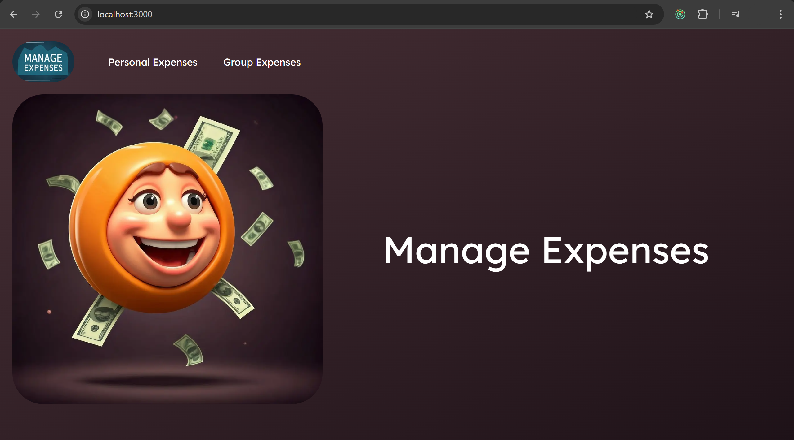

2. Login Page
   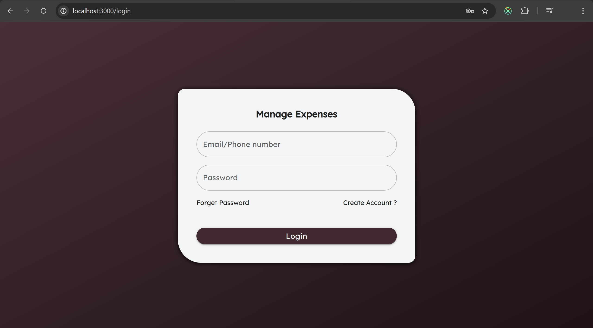

3. Signup Page
   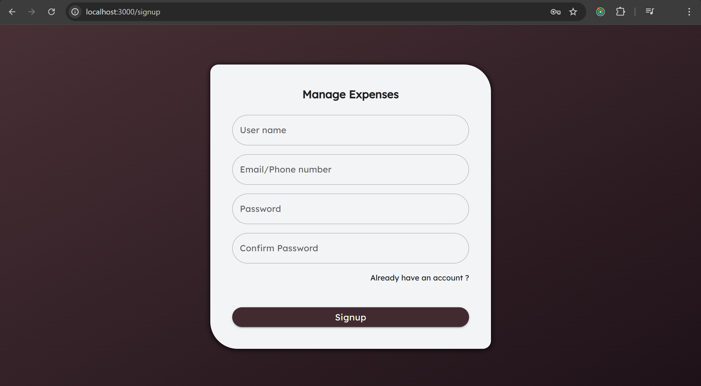

4. Home Page
   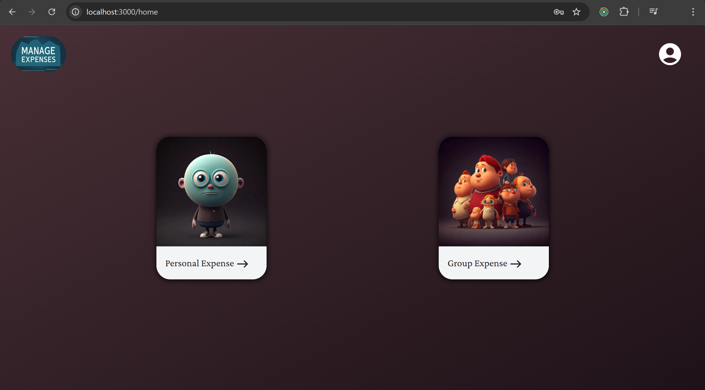

5. Personal Expenses Page
   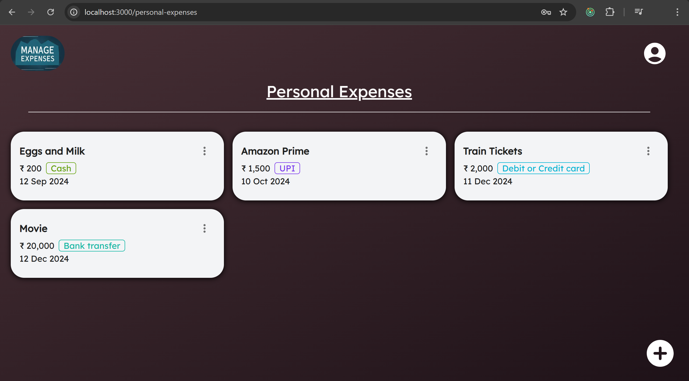

6. Add Personal Expense
   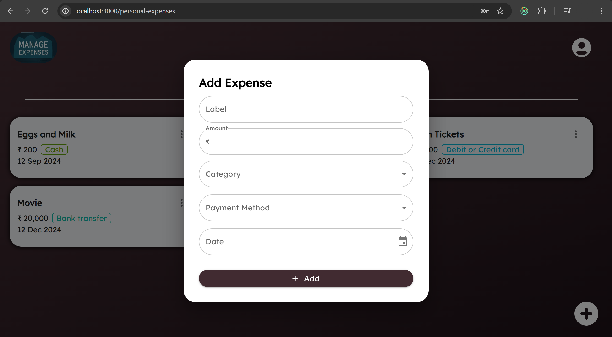

7. Edit Personal Expense
   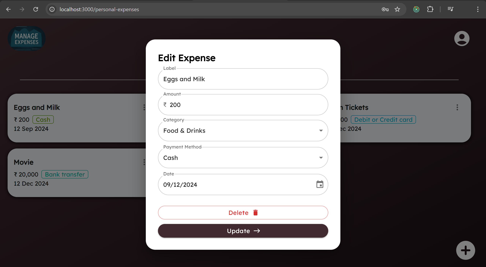

8. Groups Page
   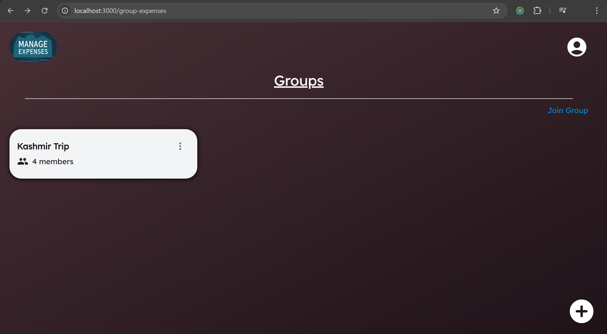

9. Create Group
   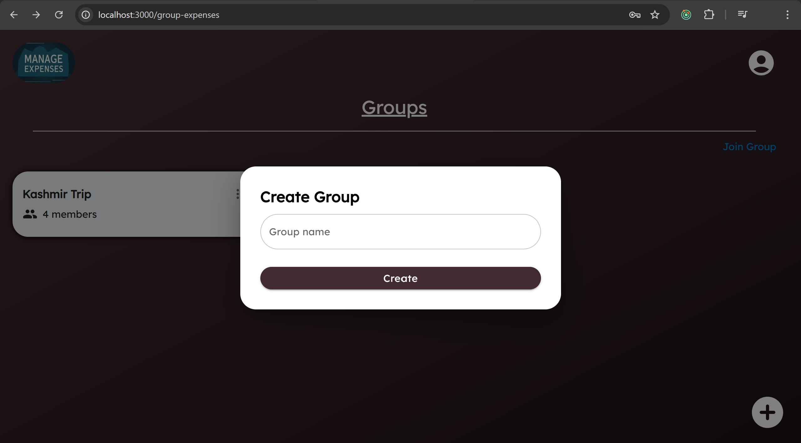

10. Edit Group
    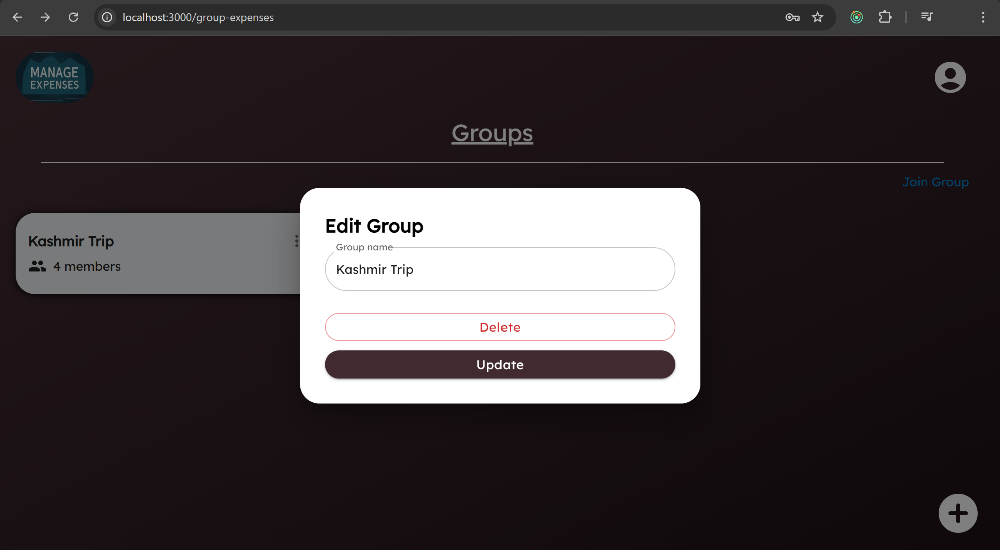

11. Join Group
    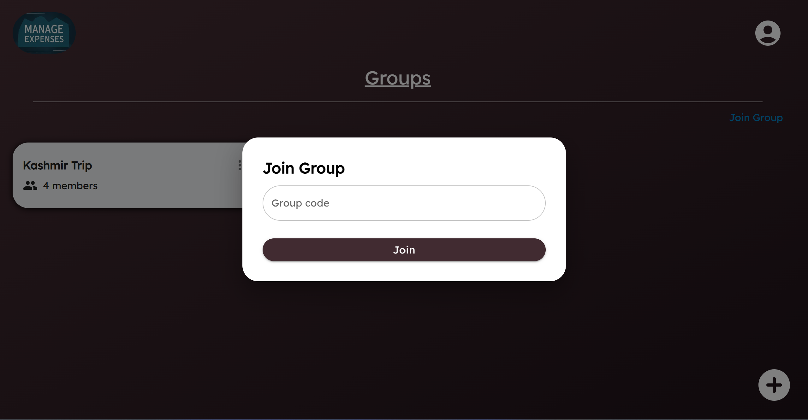

12. Group Expenses
    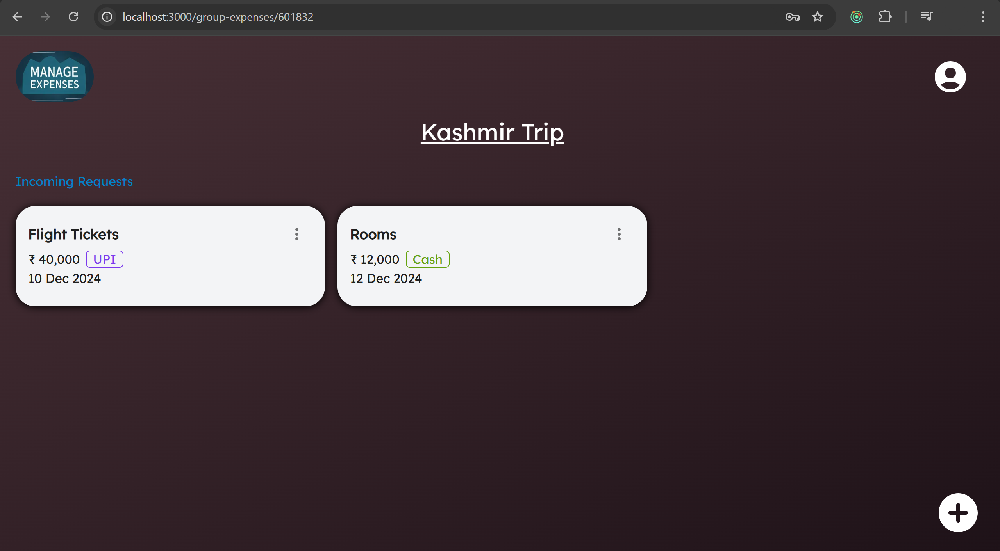

13. Join Requests
    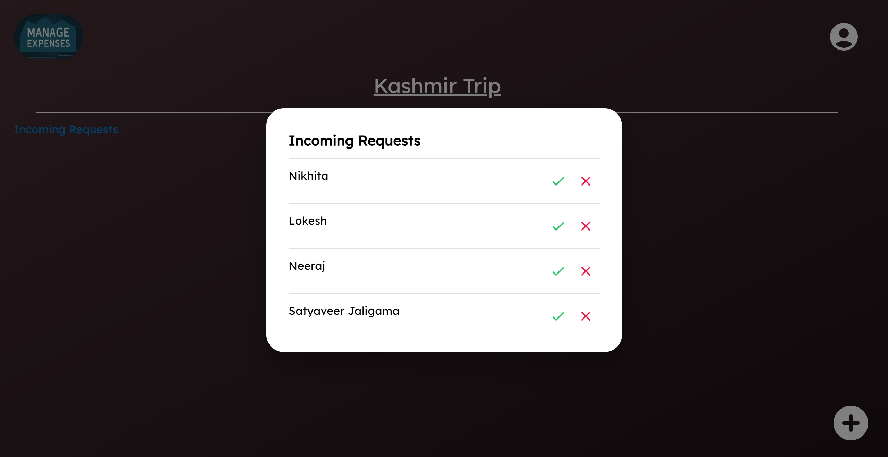

14. Add Group Expense
    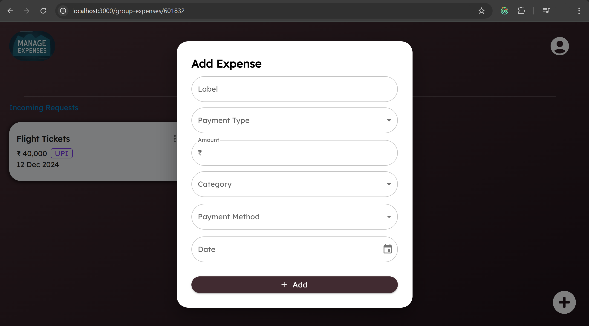
